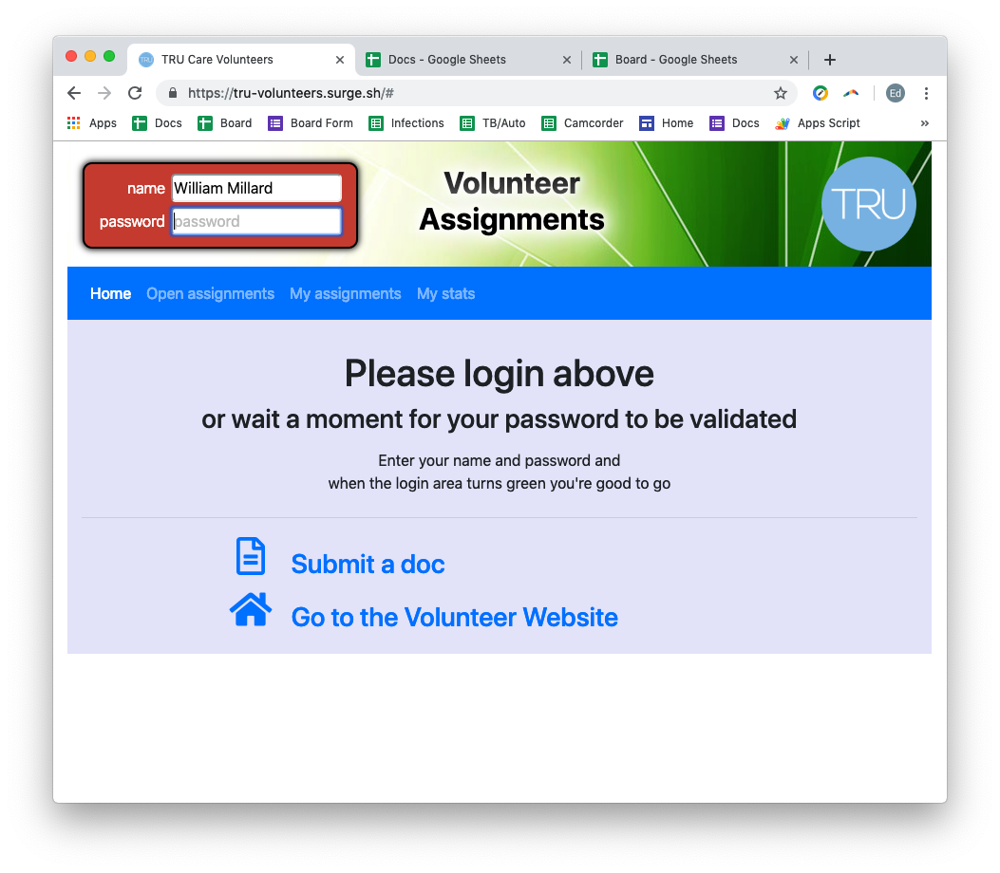
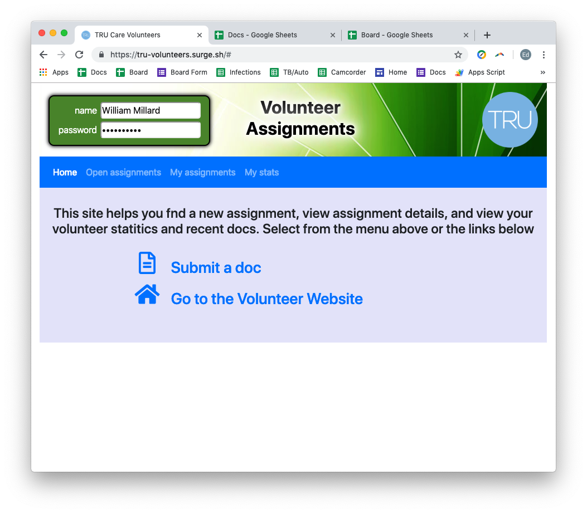

# TRU Care Volunteer Assignment Site

# Videos of the site in action

* [Narrated](https://www.youtube.com/watch?v=ZC4nEUYeXLU)
* [Silent](https://youtu.be/Pxv0j7-7gxw)

# Overview

This site allows TRU Care's 100+ volunteers to:
* view available volunteer assignments
* take a volunteer assignment
* view the details (phone, address, etc) for their assignments
* view a summary of their volunteer history (hours / miles by year)
* view the patient visit documentation they've submitted in the past 90 days  

The site links to:
* the volunteer's "home" page, administered via Google Sites
* a Google Form for volunteers to submit documentation of their patient visits

# Login process

Menu is disabled and a dummy page is displayed until login is completed.

### incomplete login

### valid login

# Open Assignments page

Lists assignments grouped by Care Plan and then in reverse date order of when
they were posted.  Badges highlight:
* new assignments posted since the last time the user viewed this page (app
  stores the last viewed date/time in local storage)
* assignments posted > 7 days ago
* assignments posted > 14 days ago  

Clicking an assignment will slide it open to reveal basic information on the
assignment with names redacted (they appears as "#name#" in the text).

### open assignments page

### "take it" button in lower-right

At the bottom of the assignment details is a button to take the assignment.

### wait button in lower-right

When a user clicks to take an assignment the button changes to a wait message
while an AJAX call is made to try to take the assignment.  

### assignment no longer available

If the assignment was taken by another volunteer or removed by a volunteer coordinator
a modal is displayed and the button in the lower right changes to "Assignment Unavailable".

# My Assignments page

Lists the volunteer's active assignments.  The volunteer coordinators can remove
or hide assignments from the spreadsheet containing the assignments.  This page
functions similarly to the open assignments page, allowing the user to click
an assignment to see the details.  On this page more information on the
assignment is shown (including names, phone numbers, etc).

### assignments page

# My Stats page

Lists annual totals and the docs volunteer has submitted in the last 90 days.

### my stats page

# Axios details

All calls to axios/ajax that load page data are cancelled if a second request
is made.  Example:  a user repeatedly clicks a menu choice to reload a page OR
a user quickly moves to another page before the first page completed its AJAX
call.

# Data

Data is accessed via a Google Apps Script Restful API that maintains a table
of assignments (open and assigned) and another table with the 'docs'
submitted by volunteers.

The code for this is in server.js and runs as a Google Apps Scripts
project on Google's servers.

The data is maintained, and server.js is executed, in the context of the
edphelps@trucare.org Google account.
